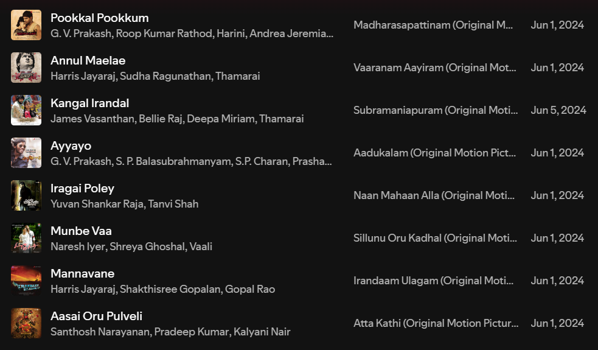

<h1 align="left">
  
  Hi, I'm <strong>Hari</strong>
</h1>

<h3>Cloud Engineer | AWS • Terraform • Kubernetes • Docker</h3>

  

  

    I'm a Cloud Engineer passionate about designing, building, and maintaining scalable and secure cloud infrastructures. 
    From automating deployments to optimizing distributed systems, I ensure applications are highly available, resilient, and fast.
  

  

    
    
    
    
  

<h3>🌐 Socials</h3>
  

  

  

  

  

  

  

 

## 🛠️ Skills

<table>
<tr>
<td width="50%" align="center">
<h3>💻 Languages & Scripting</h3>

 
  

</td>

<td width="50%" align="center">
   <h3>☁️ Cloud & DevOps</h3>

</td>

</tr>
<tr>
<td width="50%" align="center">
  <h3>🗄️ Databases</h3>
    
  

</td>

<td width="50%" align="center">
    <h3>🧰 Tools & CI/CD</h3>
    
</td>
</tr>
</table>

## 📊 GitHub Stats

### Stars & Streaks

  
  

 

### Statistics

  
  
   
  
  
   
  

 

### 🏆 GitHub Trophies

  

 

### 📈 Activity Graph

  

 

### 🐍 Contribution Graph

  <picture>
    <source media="(prefers-color-scheme: dark)" srcset="https://raw.githubusercontent.com/hari14official/hari14official/output/github-contribution-grid-snake-dark.svg">
    <source media="(prefers-color-scheme: light)" srcset="https://raw.githubusercontent.com/hari14official/hari14official/output/github-contribution-grid-snake.svg">
    
  </picture>

 

### 🎵 Playlist

  

---

## ❤️ Support Me

  

